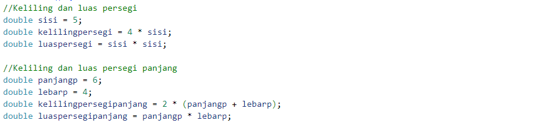

<h1>Soal Prioritas 1</h1>
<ol>
  <li>Buatlah rumus keliling dan luas persegi dan persegi panjang dengan menggunakan bahasa pemrograman Dart
  
Jawaban:

  

  <li>dekstop (memerlukan proses instalasi sebelum digunakan)</li>
  <li>mobile (memerlukan proses instalasi dan dapat digunakan pada smartphone atau tablet)</li>
</ol>